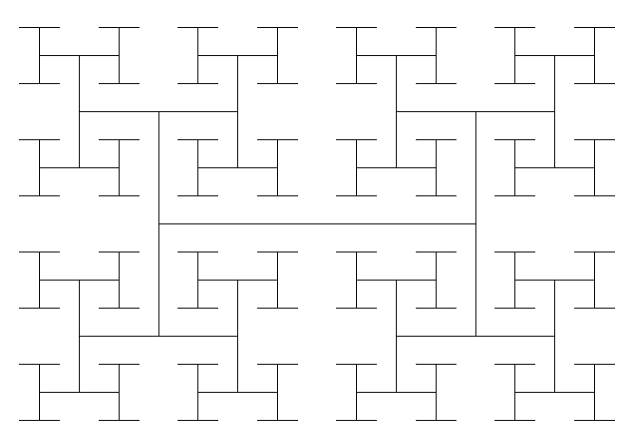

# Htree

Minimal crate for HTree fractals.

## Example Usage


The following code snippet will draw an HTree of order $6$ scaled by a factor of $700$.
```Rust

use htree::HTree;
use image::{ImageBuffer, Luma};
use imageproc::drawing::draw_line_segment_mut;

let order=5;
let htree: HTree<f32> = HTree::new(order);

// scale fractal by a factor of 700
let scale = 700f32;

//dimensions of resulting image
let width = (scale * 1f32) as u32;
let height = (scale * 1f32 / 2f32.sqrt()) as u32;

let mut image: ImageBuffer<Luma<u8>, Vec<u8>> = ImageBuffer::new(width, height);
// white background
image.fill(255u8);

let black = Luma([0u8]);
for (start, stop) in htree.into_iter().map(|(start, stop)| {
    (
        (start.0 * scale, start.1 * scale),
        (stop.0 * scale, stop.1 * scale),
    )
}) {
    // Draw a line of the HTree in black
    draw_line_segment_mut(&mut image, (start.0, start.1), (stop.0, stop.1), black);
}
let path=format!("resources/example_htree_order_{order}.png");
image.save(path);
```
The output of this code snippet is :

